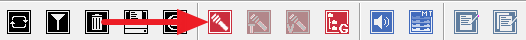
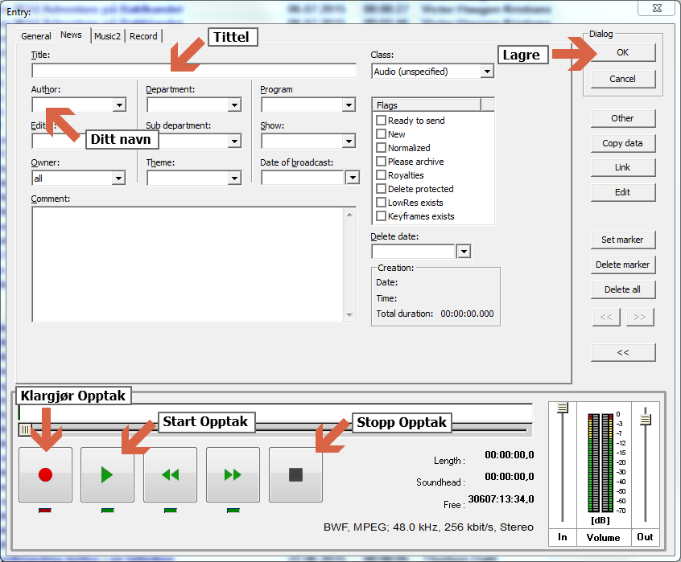
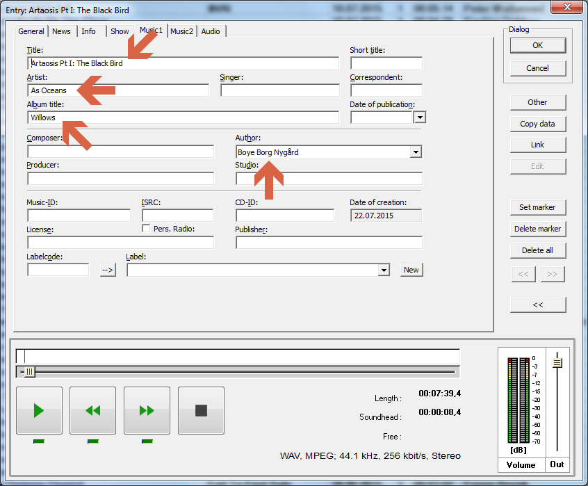
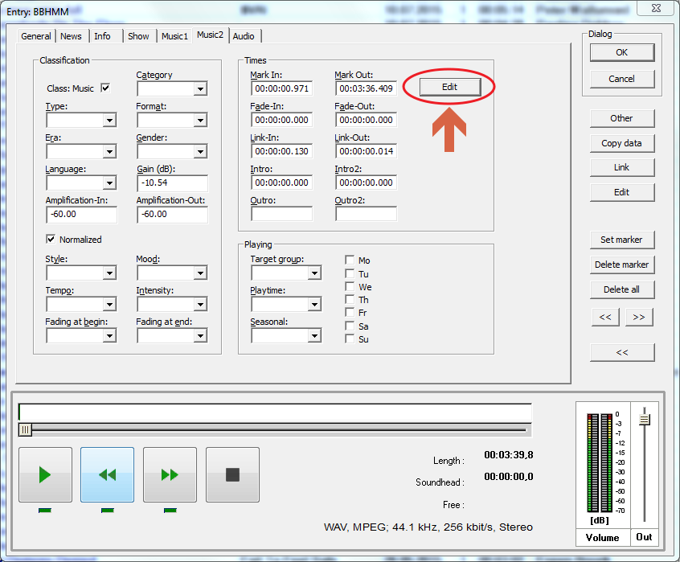
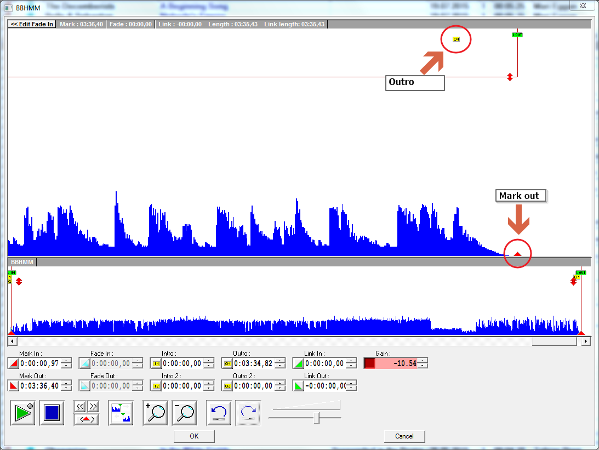
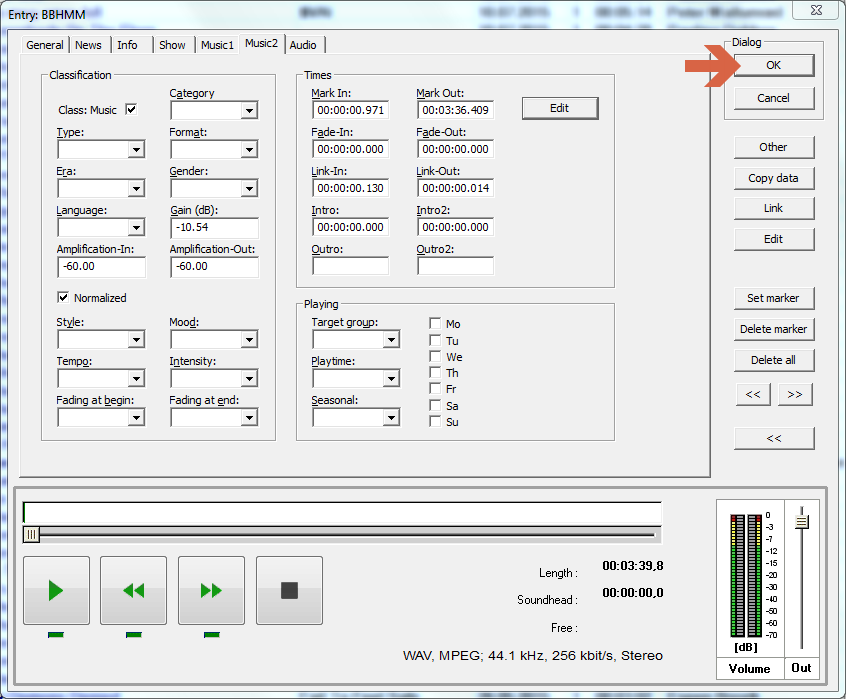

# Into til David Systems

I radioen bruker vi en programvarepakke som heter *David Systems*. Denne pakken består av:
* Diga Systems Database Manager (radioslang: "digas")
* DigAIRange
* Turboplayer
* Multitrack

## Digas
Dette er *databaseprogrammet* vårt. Her finner du all musikken vår, alle de tidligere sendingene våre, alle effektene og jinglene våre og liknende. Dette programmet kan bruker du dersom:

1. Du lager en sending og trenger musikk, jingler, effekter eller annen type lyd
2. Du skal spille inn noe lyd (du bruker digas fordi det er der du skal lagre lyden du spiller inn)
3. Du lager en jingle og trenger å hente noe lyd du har spilt inn (i punktet over).
4. Du har funnet en dødskul sang som ikke ligger i programmet fra før av
5. Du skal publisere en podkast
6. Du skal bruke en lydfil i en artikkel du skriver på dusken.no (Chimera)

### Navigasjon

Øvest til venstre finner du *valgmenyen*. Der kan du velge hva du vil se.

I "Musikkarkivet" vårt finner du for eksempel all musikken vår. I "Sendinger" ligger alle tidligere sendinger. 

Rett over valgmenyen finner du en nedtrekksmeny. Den står somregel på "Standard". Den avgjør hvor mange valg du ser i valgmenyen. Dersom du velger "Alle" får du se alt som finnes.

Rett under valgmenyen finner du et valgtre. Der kan du finne samlinger av litt diverse ting. Under "Category" finner du f.eks. A- og B-listene våre.

### Opptak
Opptak gjøres ved å trykke på den rød mikrofonknappen i menyen øvert.

Deretter trykker du på record-knappen for å klargjøre opptaket, og play-knappen for å starte opptaket. Når opptaket er ferdig trykker du på stopp-knappen for å stoppe opptaket. Du kan nå høre på opptaket ved å trykke på play-knappen.

Hvis du er fornøyd med opptaket fyller du inn tittel, finner deg selv i nedtrekksmenyen under "Author" og trykker på OK for å lagre.

Dersom det er deler av opptaket du ikke er fornøyd med kan du flytte markøren til den delen du ikke liker, og gjenta opptaksprosessen. Da vil da ta opp fra der du plasserte markøren, og lyden du tar opp over vil bli slettet.

### Legge inn sang
Velg først "Musikkarkiv" i valgmenyen til venstre. Gå så til `Entry -> Import files` i verktøymenyen øvers, og velg filen du vil importere.

Fyll inn info om sangen du nettopp la inn.

Bytt til fanen "Music2" for å sette into- og utrotid. Trykk på edit for å komme til en bedre editor, der du kan sette disse parameterene mer nøyaktig.

Pass også på at mark-in og mark-out er satt til når sangen faktisk starter og slutter, så det er ikke blir lange perioder på starten og sluytten av sangen der det bare er stille.

Trykk til slutt på OK for å lagre.

